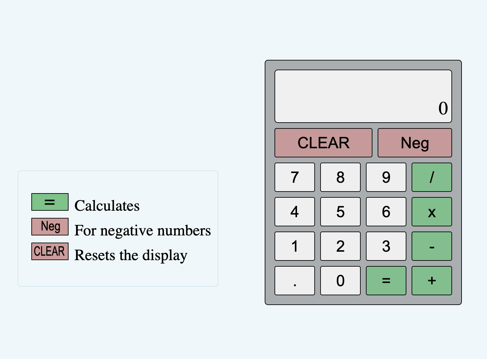
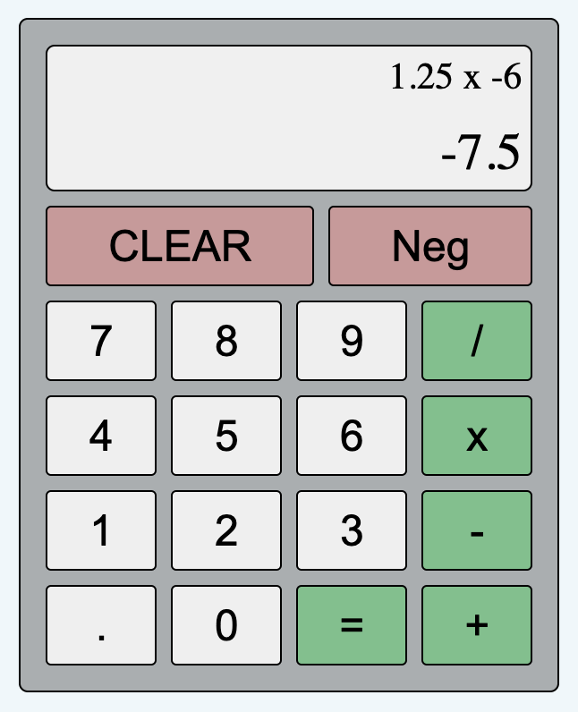

## Calculator
This project creates a calculator.

## Overview:

<ul>
    <li>The calculator can do addition, subtraction, multiplication, and division.</li>
    <li>The numeric keypad, includes a decimal for floating numbers.</li>
    <li>"Neg" is used to create negative numbers.</li>
    <li>"Clear" resets the display of the calculator.</li>
    <li>The display is updated as we press the keys.</li>
</ul>

## Project Files:
<ul>
    <li><b>index.html:</b> the html tags, DOM setup and related meta information</li>
    <li><b>script.jss:</b> the JS code for EventListener, and operations</li>
    <li><b>style.css:</b> styling details for FlexBox, Grid, Buttons, etc</li>
    <li><b>ReadMe:</b> this document</li>
    <li><b>.gitignore:</b> file setup to ignore Mac system files on local machine</li>
    <li><b>root/images:</b> the icon, and images used for Legend with Calculator and ReadMe</li>
</ul>

