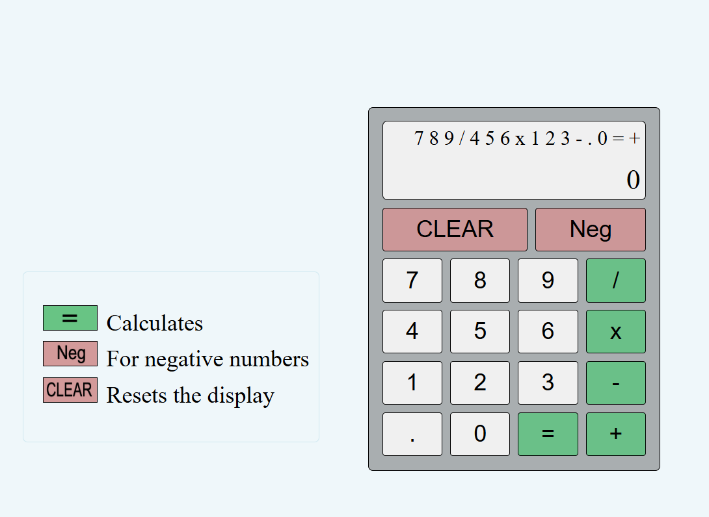
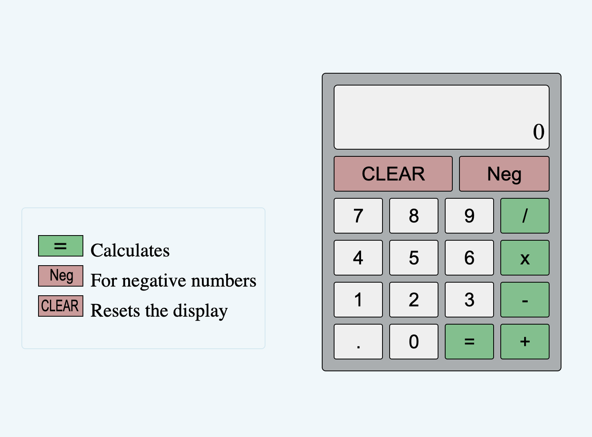
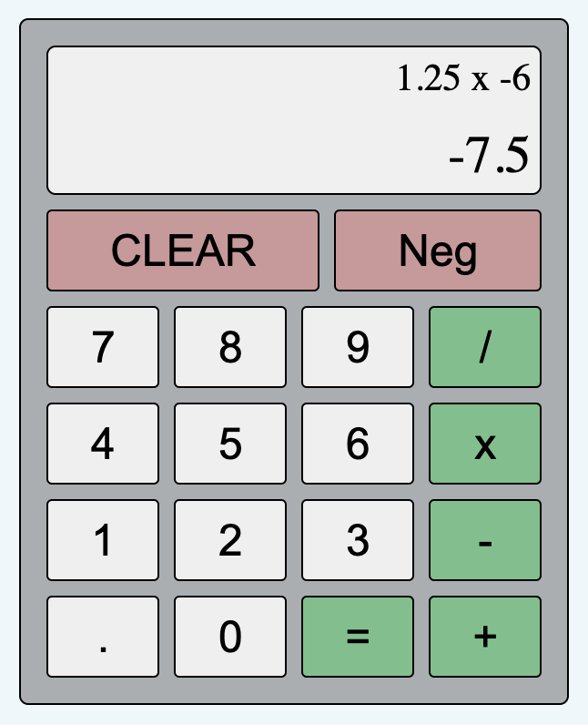

## Calculator 2.0

Welcome to Calculator 2.0!!!

[](#table-of-contents)

The calculator can now do progressive/additional arithmatic:
```
Earlier, you could only do 3 + 4 = 7
Now, you can do:
 3 + 4 = 7
        * 4 (do arithematic on previous result)
       = 21

and so on..
```


[](#table-of-contents)

You can also use negative numbers with this:


[](#table-of-contents)

Other changes:
* Clean code, more readable
* HTML file was updated to remove redundancy but the UI layout was not changed
* The displays mimic real-life calculators more closely
* Fixed the bug below that occured when non-button areas of event listener were accidentally clicked:



[](#table-of-contents)

[](#table-of-contents)

## The section below describes Calculator 1.0

## Overview:

<ul>
    <li>The calculator can do addition, subtraction, multiplication, and division.</li>
    <li>The numeric keypad, includes a decimal for floating numbers.</li>
    <li>"Neg" is used to create negative numbers.</li>
    <li>"Clear" resets the display of the calculator.</li>
    <li>The display is updated as we press the keys.</li>
</ul>

[](#table-of-contents)

## Project Files:
<ul>
    <li><b>index.html:</b> the html tags, DOM setup and related meta information</li>
    <li><b>script.jss:</b> the JS code for EventListener, and operations</li>
    <li><b>style.css:</b> styling details for FlexBox, Grid, Buttons, etc</li>
    <li><b>ReadMe:</b> this document</li>
    <li><b>.gitignore:</b> file setup to ignore Mac system files on local machine</li>
    <li><b>root/images:</b> the icon, and images used for Legend with Calculator and ReadMe</li>
</ul>

[](#table-of-contents)



